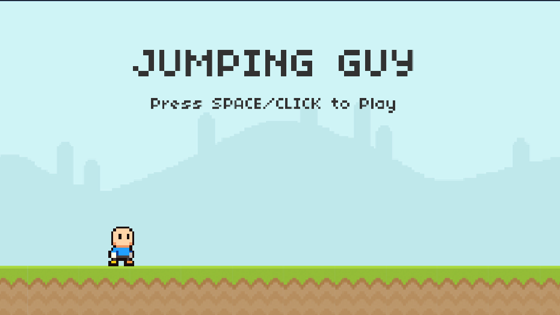

# 🎮 Jumping Guy

<div align="center">
  
</div>

**Jumping Guy** es un juego 2D estilo *endless runner* desarrollado en **Unity** con **C#**.  
El objetivo es simple: **salta enemigos, acumula puntos y sobrevive el mayor tiempo posible**.  
La dificultad aumenta a medida que pasa el tiempo, ya que la velocidad de juego se incrementa progresivamente.

---

## 🕹️ Gameplay

- 👾 Enemigos que aparecen de forma aleatoria.  
- ⚡ Velocidad progresiva que incrementa la dificultad.  
- 🏆 Sistema de puntaje que guarda el récord más alto.  
- 🎮 **Controles**:  
  - `Espacio` o `Click` → Saltar  
  - `Esc` → Salir del juego  

---

## 📂 Estructura del proyecto

```text
Jumping_Guy/
│
├─ Assets/
│  ├─ Animations/      # Animaciones de jugador y enemigos
│  ├─ Audio/           # Efectos de sonido y música
│  ├─ Background/      # Fondos con efecto parallax
│  ├─ Fonts/           # Tipografías usadas en el UI
│  ├─ Prefabs/         # Objetos reutilizables
│  ├─ Scenes/          # Escenas principales del juego
│  ├─ Scripts/         # Lógica en C# (PlayerManager, GameManager, etc.)
│  └─ Sprites/         # Arte en pixel art
│
├─ ProjectSettings/     # Configuración del proyecto Unity
├─ Packages/            # Dependencias y paquetes de Unity
└─ docs/                # Imágenes y documentación

```

### Scripts principales
- **PlayerManager** → Control del jugador (salto, colisiones, animaciones).  
- **GameManager** → Estados del juego (Ready, Playing, Ended).  
- **SpawnManager** → Generación de enemigos.  
- **ScoreManager** → Manejo de puntaje y récords.  
- **SpeedManager** → Incremento progresivo de velocidad.  
- **AudioManager** → Efectos de sonido.  

---

## 🛠️ Tecnologías utilizadas

- [Unity](https://unity.com/) 2021.3+  
- [C#](https://learn.microsoft.com/en-us/dotnet/csharp/)  
- [TextMeshPro](https://docs.unity3d.com/Packages/com.unity.textmeshpro@latest/)  
- Animaciones con el sistema **Animator**  
- Efecto **Parallax** en escenario  

---

## 🚀 Cómo jugar

1. Descarga la versión compilada en [Releases](../../releases).  
2. Extrae el archivo `.zip`.  
3. Ejecuta el `.exe` (Windows) para comenzar a jugar.  

 
